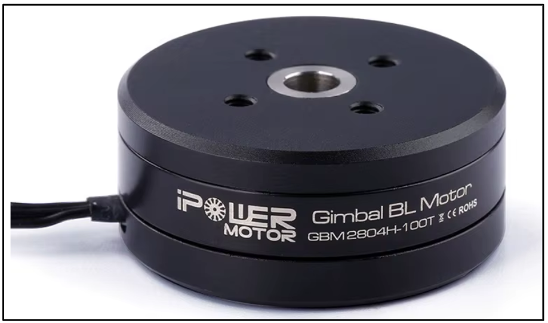
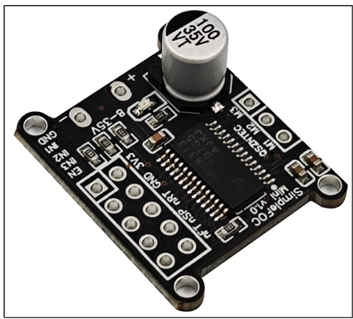
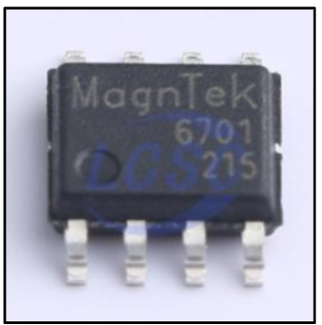

# LOCOMOÇÃO

## MOTOR
Modelo: GBM2804H-100T Gimbal Motor

    

Especificações: 
Modelo NO.: GBM2804H-100T 
Peso: 41,5g 
Dimensão do motor: 35 mm * 15 mm 
Diâmetro do estator: 28mm * 4mm 
Fio de cobre (OD): 0,19 mm 
Configuração: 12N14P 
Resistência: 11,2 ohms 
Passo central da base: 16mm 19mm 
Pré-enrolado: com eixo oco de 100 voltas 
Tensão de teste: 11,1V 
Tensão máxima: 14,8 V 
Corrente de teste: 0,0099 A 
Corrente máxima: 5A 
Velocidade de rotação do teste: 1637 rpm 
Velocidade máxima de rotação: 2180 rpm 

O motor escolhido foi pensado em ter um motor que ocupe menos espaço e proporcione um torque adequado para a locomoção do robô. O fato de possuir cerca de 11 Ohms de resistência interna, faz com que haja uma corrente menor sendo consumida pelo motor, isso ajuda na escolha do driver de acionamento, pois possibilita escolher um driver com uma capacidade de corrente menor.

## DRIVER
Modelo: DRV8313

    

Especificações: 
Arquitetura: Integrated FET 
Interface de controle: 3xPWM 
RDS(ON) (HS + LS) (mΩ): 480 
Corrente de pico de saída máx. (A): 3 
Vs (min) (V): 8 
Vs ABS (max) (V): 65 
Faixa de temperatura de operação (°C): -40 até 125 

Esta é uma figura que ilustra um modelo de placa desenvolvida baseada no CI DRV8313 para o controle de um motor brushless e é um modelo de construção bastante utilizado em projetos com FOC. Mais especificações podem ser encontradas no datasheet do componente: [DRV8313 datasheet (Rev. D)](https://www.ti.com/lit/ds/symlink/drv8313.pdf?ts=1744957647878&ref_url=https%253A%252F%252Fwww.ti.com%252Fproduct%252FDRV8313)

## ENCODER
Modelo: MT6701CT-STD-R

    

O encoder é um componente importante no controle de velocidade do robô, visto que é necessário ter o valor da velocidade mais precisa durante a tomada de decisão ajuda a criar estratégias mais efetivas durante os jogos. Este tipo de encoder pode se comunicar utilizando o protocolo I2C, que facilita as conexões. Mais especificações podem ser encontradas em: [MT6701CT-STD-R | Datasheet LCSC Electronics](https://www.lcsc.com/datasheet/C3003196.pdf). Já existe uma biblioteca para o uso deste sensor com o Arduino IDE, que facilita a programação.
	
## STEP-UP DE ALIMENTAÇÃO DOS MOTORES
