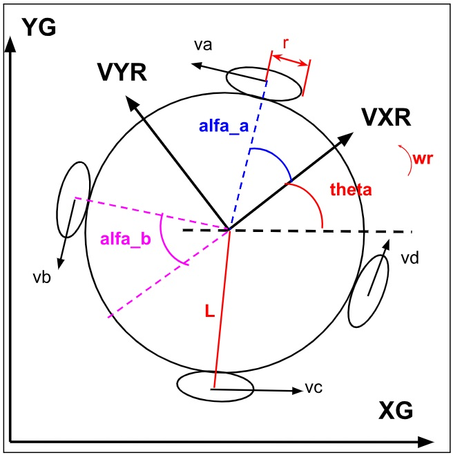
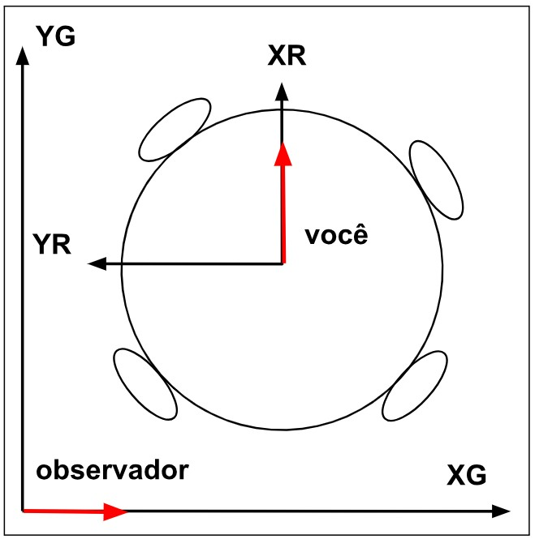
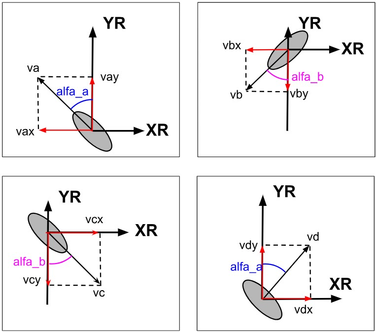

# CINEMÁTICA DO ROBÔ

Com o objetivo de tentar explicar de uma maneira mais detalhada, esta será uma seção com muitas imagens e matrizes. É recomendado que se tenha um conhecimento sobre operações com matrizes, algumas noções matemáticas envolvendo trigonometria, noções de geometria analítica e alguns conceitos de física relacionada à velocidade linear e angular. Um último tópico que é preciso saber é sobre notações, durante todo o desenvolvimento dos cálculos, não serão utilizados os números das medidas do robô, mas sim letras que representam cada medida, com o objetivo de tornar as passagens mais fáceis de entender e compreender onde cada valor pode impactar. A figura a seguir mostra todos os termos que serão utilizados na análise da cinemática do robô.

A cinemática servirá para entender como o movimento linear e angular do robô pode ser controlado através de cada motor, isto é, como cada motor pode contribuir com o movimento do robô no ambiente em que ele está inserido.

    

Onde:

YG = posição Y global do Robô 
XG = posição X global do Robô

VYR = Velocidade na direção Y relativo ao Robô 
VXR = Velocidade na direção X relativo ao Robô

L =Distância do centro da roda até o centro do robô 
r = Raio da roda do robô 
\(\theta\)(theta) = Orientação do robô em relação a XG e YG 
wr = Velocidade angular do robô

\(\alpha_a\) (alfa_a) = Ângulo da roda "a" e "d" em relação ao eixo XR do robô 
\(\alpha_b\)(alfa_b) = Ângulo da roda "b" e "c" em relação ao eixo XR do robô 
va = Velocidade da roda "a" 
vb = Velocidade da roda "b" 
vc = Velocidade da roda "c" 
vd = Velocidade da roda "d"

### Sistemas de Referência

Dois sistemas de referência são utilizados na análise:

- **Base Global** \((X_G, Y_G)\): sistema fixo no chão, do ponto de vista de um observador externo estático. É neste referencial que a câmera do SSL-Vision fornece a posição do robô.
- **Base do Robô** \((X_R, Y_R)\): sistema de referência móvel preso ao centro do robô. Acompanha o robô em sua rotação. É neste referencial que os motores atuam.

    

Para converter vetores de velocidade entre as duas bases utiliza-se a matriz de rotação \(R(\theta)\), onde \(\theta\) é o ângulo de orientação atual do robô em relação ao eixo \(X_G\):

\[
R(\theta) =
\begin{bmatrix}
\cos\theta & -\sin\theta & 0 \\
\sin\theta & \cos\theta & 0 \\
0 & 0 & 1
\end{bmatrix}
\]

### Contribuição de Cada Roda

Cada roda sueca gera uma velocidade linear tangencial perpendicular ao seu eixo de giro. A contribuição dessa velocidade nos eixos \(X_R\) e \(Y_R\) do robô depende do ângulo \(\alpha_n\) que a roda faz com o eixo \(X_R\). Para as 4 rodas \((a, b, c, d)\):

    

| Roda | Ângulo \((\alpha_n)\) | Contribuição em \(X_R\) | Contribuição em \(Y_R\) |
|---|---|---|---|
| a (dianteira esq.) | \(\alpha_a\) | \(-\sin(\alpha_a)\, v_a\) | \(\cos(\alpha_a)\, v_a\) |
| b (traseira esq.) | \(\alpha_b\) | \(-\sin(\alpha_b)\, v_b\) | \(-\cos(\alpha_b)\, v_b\) |
| c (traseira dir.) | \(\alpha_b\) | \(\sin(\alpha_b)\, v_c\) | \(-\cos(\alpha_b)\, v_c\) |
| d (dianteira dir.) | \(\alpha_a\) | \(\sin(\alpha_a)\, v_d\) | \(\cos(\alpha_a)\, v_d\) |

Sendo \(v_n = \omega_n \cdot r\) (velocidade linear = velocidade angular do motor × raio da roda).

### Equação de Cinemática Direta

Reunindo as contribuições de todos os motores na forma matricial, obtemos a velocidade do robô em sua própria base \((X'_R, Y'_R, \theta')\) em função das velocidades angulares dos 4 motores:

\[
\begin{bmatrix}
X'_R \\
Y'_R \\
\theta'
\end{bmatrix}
=
\begin{bmatrix}
-\sin(\alpha_a) & -\sin(\alpha_b) & \sin(\alpha_b) & \sin(\alpha_a) \\
\cos(\alpha_a) & -\cos(\alpha_b) & -\cos(\alpha_b) & \cos(\alpha_a) \\
\frac{1}{2L} & \frac{1}{2L} & \frac{1}{2L} & \frac{1}{2L}
\end{bmatrix}
\cdot
\begin{bmatrix}
r & 0 & 0 & 0 \\
0 & r & 0 & 0 \\
0 & 0 & r & 0 \\
0 & 0 & 0 & r
\end{bmatrix}
\cdot
\begin{bmatrix}
\omega_a \\
\omega_b \\
\omega_c \\
\omega_d
\end{bmatrix}
\]

Onde \(L\) é a distância do centro de cada roda ao centro do robô, e \(r\) é o raio da roda.

### Conversão para Referencial Global

Para obter as velocidades no referencial global, necessário para navegar pelo campo usando as posições fornecidas pelo SSL-Vision, aplica-se a matriz de rotação:

\[
\begin{bmatrix}
X'_G \\
Y'_G \\
\theta'
\end{bmatrix}
=
R(\theta)
\cdot
\begin{bmatrix}
X'_R \\
Y'_R \\
\theta'
\end{bmatrix}
\]

### Cinemática Inversa — O Problema Real do Controle

Durante um jogo, o software de estratégia determina a velocidade desejada do robô no referencial global \([V_{XG}, V_{YG}, \omega_{robô}]\). O firmware precisa converter esses valores em velocidades angulares para cada motor \([\omega_a, \omega_b, \omega_c, \omega_d]\). Isso é a cinemática inversa.

Como a matriz cinemática é \(3 \times 4\) (sistema sobredeterminado), não existe inversa direta. Usa-se a pseudo-inversa de Moore-Penrose:

\[
\begin{bmatrix}
\omega_a \\
\omega_b \\
\omega_c \\
\omega_d
\end{bmatrix}
=
\frac{1}{r} \cdot M^{+} \cdot R(\theta)^{-1}
\cdot
\begin{bmatrix}
V_{XG} \\
V_{YG} \\
\omega_{robô}
\end{bmatrix}
\]

Onde \(M^{+}\) é a pseudo-inversa da matriz cinemática. Essa operação pode ser computada offline e armazenada como uma matriz constante, já que \(\alpha_a\), \(\alpha_b\) e \(L\) são fixos no robô, sendo apenas \(R(\theta)^{-1}\) recalculada a cada ciclo de controle com o \(\theta\) atual.

### Resumo do Fluxo de Controle Cinemático

1. SSL-Vision envia posição e orientação \((x, y, \theta)\) do robô.
2. O software de estratégia calcula a velocidade desejada \((V_{XG}, V_{YG}, \omega)\) no referencial global.
3. Aplica \(R(\theta)^{-1}\) para converter para a base do robô \((V_{XR}, V_{YR}, \omega)\).
4. Aplica a pseudo-inversa \(M^{+}\) para obter as velocidades angulares \((\omega_a, \omega_b, \omega_c, \omega_d)\).
5. Envia \(\omega_a \ldots \omega_d\) para os STM32, que executam o controle FOC de cada motor.