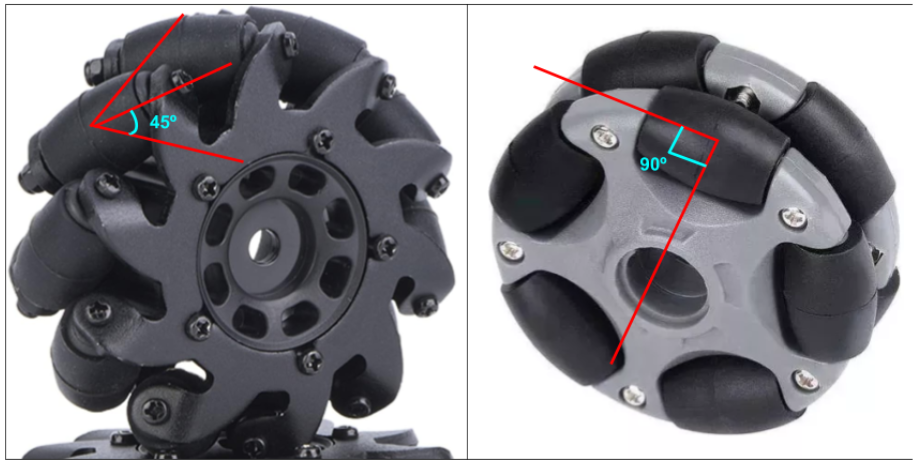
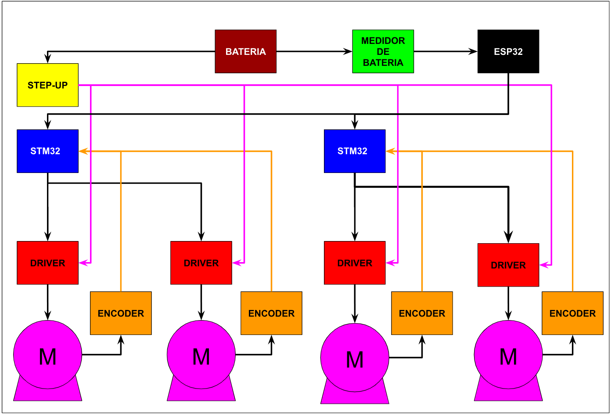

# LOCOMOÇÃO

## RODAS

No desenvolvimento de robôs móveis, a locomoção é uma das partes mais importantes, pois sem ela a palavra “móvel” na categoria do robô não faria sentido. Por isso ter uma locomoção bem projetada é fundamental para o sucesso do projeto e alcance dos objetivos. Na categoria de futebol SSL (Small Size Soccer), a maioria dos robôs possuem uma locomoção omnidirecional e utilizam 4 rodas dispostas de maneira a proporcionar este tipo de movimentação. A principal vantagem da locomoção omnidirecional é a possibilidade de se locomover em qualquer sentido, com o robô estando em qualquer orientação, possibilitando manobras mais elaboradas e movimentação precisa.
	
O primeiro passo para começar o desenvolvimento da locomoção é escolher o tipo de roda que será utilizado. Existem diversos tipos de rodas que servem para locomoções omnidirecionais. Dois modelos de rodas bastante vistos nesse tipo de locomoção são os modelos de roda sueca de 45º e 90º. Que utilizam de uma espécie de rolamentos em volta do eixo principal para proporcionar o movimento omnidirecional. Os ângulos de 45º e 90º referem-se ao posicionamento dos rolamentos em relação ao eixo principal que é acoplado ao motor. O modelo adotado no projeto é a roda sueca 90º, devido a facilidade na modelagem 3D e montagem no robô. Um exemplo de cada um dos tipos mencionados está nas figuras abaixo. 

    

A disposição das rodas no robô também impacta no seu desempenho tanto em questão de mobilidade quanto em questão de cálculos. Para se obter o movimento omnidirecional do robô, as rodas suecas 90º devem estar dispostas de modo que as rodas não fiquem paralelas umas às outras. No caso das rodas suecas 45º, como os rolamentos estão angulados em relação ao eixo principal de giro, as rodas devem ficar paralelas, caso contrário, a locomoção não ocorrerá de maneira adequada. A posição escolhida para o robô foi de colocar as 2 rodas anguladas de 90º entre si e as outras 2 rodas anguladas em 120º, devido ao espaço interno disponível do robô.

Para acionar as rodas, são necessários motores, e a escolha do tipo de motor afeta muitas outras variáveis no projeto (baterias, acionamento, modelagem 3D etc) e por isso também entra como um dos primeiros passos. Existem dois tipos de motores que podem ser utilizados, os motores com escovas (Brushed Motors DC) e os motores sem escovas (Brushless Motors DC - BLDC), ambos sendo motores de corrente contínua (DC). As principais características levadas em consideração na escolha dos motores foram a responsividade e tamanho.

Um motor mais responsivo consegue trocar de sentido de rotação sem muitos esforços e várias vezes sem prejudicar a performance do robô. Outro ponto positivo é que o robô consegue ser mais ágil se o motor obedecer às mudanças de velocidade e sentido mais rapidamente, claro que a parte da eletrônica e programação devem estar de acordo com essa dinâmica para não ter impedimentos. O outro ponto sobre o tamanho do motor é que quanto menor o motor, melhor, desde que consiga entregar a potência necessária. Na questão de tamanho, os motores DC escovados são maiores em relação aos motores BLDC de mesma potência. 

No projeto, foi escolhido utilizar motores BLDC devido ao maior rendimento do motor e melhor relação tamanhoXpotência. Embora sejam motores mais caros, a vida útil é mais elevada, possuem um peso menor, e geram menos barulhos durante o acionamento. Os motores escovados DC acabam perdendo na comparação devido ao seu tamanho elevado e rendimento, visto que no projeto há limites de tamanho que devem ser respeitados e há muitos mecanismos dentro de um espaço reduzido que fazem com que o quesito “tamanho” seja bem relevante.

Uma vez determinado o tipo de motor, consequentemente é necessário determinar como será feito o acionamento de cada um. Existem soluções no mercado para vários fins e de vários tamanhos e preços, e o modelo de acionamento determinado para o projeto foi através de um projeto opensource chamado SimpleFOC que trata-se de um projeto para acionamento de motores utilizando o método FOC (Field-Oriented Control) ou Controle de campo orientado. No site disponível do projeto há um compilado de diversos arquivos que auxiliam na aplicação do método através da biblioteca usada na programação, exemplos de placas, projetos de aplicação e etc.
	
O acionamento dos motores ocorre através de uma placa comumente chamada de Driver que possui MOSFETs e um circuito interno embutidos em um CI que recebem o sinal indicando a velocidade desejada e internamente realiza o chaveamento dos MOSFETs para acionar as bobinas do BLDC de maneira adequada para atingir a velocidade desejada. 
	
Basicamente os três itens principais determinados na locomoção são rodas, motores e Drivers, esses componentes são essenciais para um bom desempenho do robô. Um diagrama de blocos na figura abaixo mostra apenas os componentes envolvidos na locomoção do robô.

    

