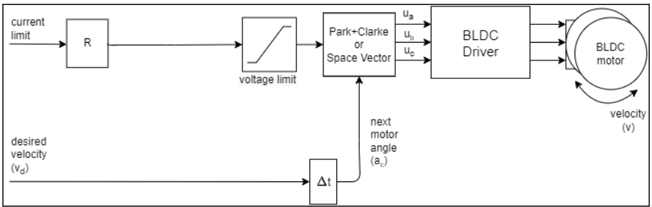

# LOCOMOÇÃO

## FOC

A principal biblioteca utilizada para o acionamento dos motores é a SimpleFOClibrary. Esta biblioteca, compatível com o Arduino IDE, implementa um algoritmo FOC (Field Oriented Control - Controle de campo orientado) para motores BLDC e motores de passo. O algoritmo FOC proporciona um controle mais suave  e gradual das velocidades dos motores, alto torque e excelentes controles de velocidade e posição. No link ao final do documento é possível verificar toda a documentação sobre o uso da biblioteca.

A seguir, serão apresentadas apenas funções presentes no código atual do robô, visto que a biblioteca possui diversas funções que não estarão sendo utilizadas no robô SSL. É importante lembrar que as funções utilizadas atualmente podem ser substituídas por outras dependendo da iteração atual do projeto. Portanto é aconselhável ler a documentação da biblioteca para ter uma compreensão melhor dos tópicos tratados aqui.

A primeira parte da programação envolve a configuração dos sensores encoder. Porém, na estrutura atual, não há encoders no robô.

### Configuração do Driver e Motor

A classe utilizada para os motores brushless é BLDCDriver3PWM que providenciará um sinal de PWM para as fases A, B e C de cada motor. Como visto no esquemático de ligação na parte de introdução, cada microcontrolador STM controla 2 motores BLDC. Assim, no código só será configurado 2 drivers.


```cpp
BLDCMotor motor = BLDCMotor(11, 10, 60);
BLDCMotor motor2 = BLDCMotor(11, 10, 60);
BLDCDriver3PWM driver = BLDCDriver3PWM(PA1, PA2, PA3, PA4);
BLDCDriver3PWM driver2 = BLDCDriver3PWM(PB1, PA2, PA3, PA5);
```

Primeiro é criado uma instância de cada motor usando a classe `BLDCMotor` que necessita dos valores:
- Número dos pares de polos: 11
- Valor da resistência de fase: 10 [Ohms]
- KV do motor: 60 [rpm/V]

Em seguida são configurados as instâncias dos drivers para cada motor com os pinos do STM:
- Pino do PWM da fase A: PA1 e PB1
- Pino do PWM da fase B: PA2
- Pino do PWM da fase C: PA3 e PA1
- Pino enable do driver: PA4 e PA5

Após estabelecer esses parâmetros, dentro da função `void setup()`, é configurado os parâmetros de inicialização de cada instância dos drivers criados.

```cpp
driver.voltage_power_supply = 12;
driver.voltage_limit = 12;
driver.init();
driver2.voltage_power_supply = 12;
driver2.voltage_limit = 12;
driver2.init();
```

Para cada instância, é necessário configurar qual o valor de tensão máxima de alimentação e o limite de tensão que será enviado aos motores e ,por fim, é chamada a função `.init()` que serve para inicializar o driver. O procedimento é realizado para cada driver configurado.

Ainda dentro do `void setup()`, os drivers criados são vinculados aos motores através da função `linkDriver()`, e o valor de corrente máxima é determinado para cada motor como sendo 300mA.

```cpp
motor.linkDriver(&driver);
motor2.linkDriver(&driver2);

motor.current_limit = 0.3; //Amps
motor2.current_limit = 0.3;
```

Por fim, é selecionado qual o modelo de controle será adotado para cada motor e depois, os motores são inicializados.

```cpp
//open loop control config]
motor.controller = MotionControlType::velocity_openloop;
motor2.controller = MotionControlType::velocity_openloop;

//init motor hardware
motor.init();
motor2.init();
```

O controle através do `velocity_openloop` utiliza o seguinte diagrama de funcionamento abaixo.

<p align="center">
    
</p>

Para movimentar o motor, é necessário inicializar a função FOC e em seguida executar o comando `move()` de modo a passar o valor da  velocidade em radianos por segundo.

```cpp
motor.move(m1);
motor2.move(m2);
```

## ENCODER
